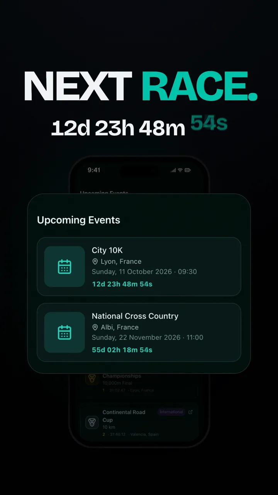

# Product Film

A Claude Code skill that turns your app or website into a kinetic launch video, built from your product's real UI.

One prompt gets you a 10 to 30 second film with fast kinetic typography, 2.5D camera moves, real motion blur and synced sound design. No fake mockups, no invented stats. It reads your actual components, copy and pricing, and renders your real interface.

<p align="center">
  <a href="https://stan-cosmin.com/resources/product-film-skill"></a>
  &nbsp;
  <a href="https://stan-cosmin.com/resources/product-film-skill"></a>
</p>

<p align="center">Two 13-second films for ProCard, built with this skill from its real components. <a href="https://stan-cosmin.com/resources/product-film-skill">Watch them here.</a></p>

## What it does

- Reads your product (design tokens, fonts, logo, real copy and pricing), then writes the story and a frame-accurate beat map.
- Builds the film in Remotion from your **real UI**. It mounts your actual React components with demo data, or captures your running app or site.
- Checks its own story: the problem comes before the solution, there's one logo reveal joined to the CTA, it ends on a question, figures are real and specific, and every line gets enough reading time.
- Renders true motion blur (4 sub-frames per frame, averaged at 16-bit) plus a sound design on a 120 BPM grid, normalised to -14 LUFS.
- Delivers 9:16 and 16:9 masters, silent copies for your own music, posters, contact sheets, the plan and a verification report.

## Requirements

- [Claude Code](https://claude.com/claude-code)
- Node 18+, ffmpeg (`brew install ffmpeg`), Python 3 with numpy, scipy and pillow (`pip3 install numpy scipy pillow`)
- macOS or Linux, and about 3 GB of free disk while a master renders
- Best results come from a React frontend repo. It works with a live website URL too (real captures).

## Install

```bash
git clone https://github.com/StanCosmin28/product-film-skill.git ~/.claude/skills/product-film
```

Or download `product-film-skill-v1.0.zip` from the [latest release](https://github.com/StanCosmin28/product-film-skill/releases/latest) and unzip it into `~/.claude/skills/`, so you end up with `~/.claude/skills/product-film/SKILL.md`.

Open Claude Code in your product's repo. The skill is picked up automatically.

## Quick start

```text
Use the product-film skill to make a 13 s wow launch video for this app, 9:16 and 16:9, with sound, only real UI. One shot, don't stop for approval.
```

The skill discovers the rest from your repo and asks only what it can't find. The full one-shot prompt, every knob (pace, length, style, brand, sound, formats, language) and troubleshooting are in [GUIDE.md](GUIDE.md).

## What's inside

| Path | What it is |
|---|---|
| `SKILL.md` | The workflow Claude follows: intake, plan, build, preview loop, verify, master |
| `GUIDE.md` | The human guide: the one-shot prompt, every knob, troubleshooting |
| `references/` | Craft (story patterns, beat templates for 10/13/15/20/30 s, pace and style presets, anti-slop rules), pipeline (every technical pitfall with its fix) and sound |
| `assets/templates/` | A ready Remotion project: motion kit, tokens, device frames, timeline, master and preview scripts, procedural sound kit |
| `scripts/scaffold.sh` | Sets up a new film project in one command and renders a smoke test |

## Honest limits

- Claude can't listen to audio. The sound design is procedural and checked visually, so listen before you publish, or use the silent master with your own track.
- Real-time 3D or physics isn't frame-deterministic. The skill offers a captured clip, or leaves it out.
- It never fakes UI, stats or trademarks. Demo data is labelled.

## License

The skill is MIT licensed, see [LICENSE](LICENSE).

Remotion has its own license: free for individuals and companies with up to 3 employees. Larger companies need a company license ([remotion.dev/license](https://remotion.dev/license)).

---

Made by [Stan Cosmin](https://stan-cosmin.com). Built with Remotion and Claude Code. More free resources at [stan-cosmin.com/resources](https://stan-cosmin.com/resources).
