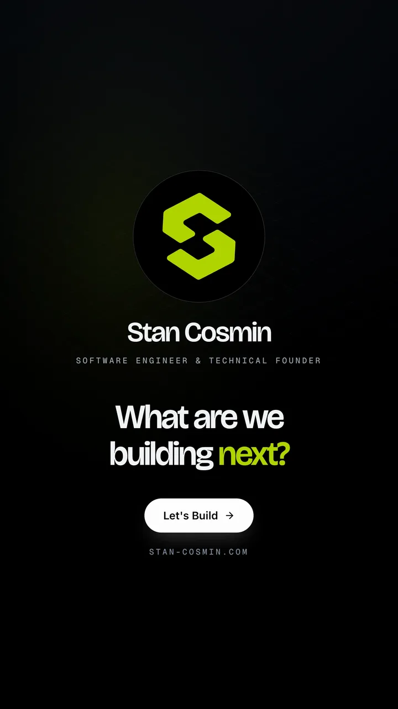

# Product Film

A Claude Code skill that turns your app, website or personal brand into a motion film, built from your real UI and cut to a real music track.

One prompt gets you a 10 to 30 second film: kinetic typography, 2.5D camera moves, real motion blur, a royalty-free track picked and measured for you, real sound effects on every move, and 4K masters. No fake mockups, no invented stats. It reads your actual components, copy, pricing and logo, and renders your real interface.

<p align="center">
  <a href="https://stan-cosmin.com/resources/product-film-skill"></a>
  &nbsp;
  <a href="https://stan-cosmin.com/resources/product-film-skill"></a>
  &nbsp;
  <a href="https://stan-cosmin.com/resources/product-film-skill"></a>
</p>

<p align="center">A 20-second brand film for stan-cosmin.com and two 13-second films for ProCard, all built with this skill from real components. <a href="https://stan-cosmin.com/resources/product-film-skill">Watch them here.</a></p>

## What it does

- Reads your product or your site (design tokens, fonts, logo, real copy, services and pricing), then writes the story and a beat map on the music's grid.
- Makes **product films** (launch, features) and **brand films** (who you are, what you solve, what you offer, how you work).
- Builds the film in Remotion from your **real UI**. It mounts your actual React components with demo data, or captures your running app or site.
- Picks a **real royalty-free track**: it searches the catalog, analyzes 10 to 15 tracks (tempo, drop, structure), and measures the beat grid. The drop lands on the turn and the logo on a downbeat.
- Places **real sound effects** on frames (each one lands its peak on the moment it's seen), and mixes to -14 LUFS.
- Uses **your real logo**: it finds the original file (even an Illustrator `.ai`) and extracts the exact vector and colours.
- Checks its own story: the problem comes before the solution, there's one logo reveal joined to the CTA, it ends on a question, figures are real and specific, and every line gets enough reading time.
- Renders at **4K** with true motion blur (4 sub-frames per frame, averaged at 16-bit), plus 1080p copies downsampled from 4K.
- Delivers 9:16 and 16:9 masters, silent copies, posters, contact sheets, the plan, the music credits and a verification report.

## Requirements

- [Claude Code](https://claude.com/claude-code)
- Node 18+, ffmpeg (`brew install ffmpeg`), Python 3 with numpy, scipy and pillow (`pip3 install numpy scipy pillow`), curl
- Optional: poppler (`brew install poppler`) to read a logo from an `.ai` or `.pdf`
- macOS or Linux, and about 20 GB of free disk while a 4K master renders (freed at the end)
- Best results come from a React frontend repo. It works with a live website URL too (real captures).

## Install

**Claude Code.** Paste this and it installs the skill for you:

```text
Install the product-film skill from https://github.com/StanCosmin28/product-film-skill
into ~/.claude/skills/product-film, then confirm SKILL.md is there.
```

**Terminal:**

```bash
git clone https://github.com/StanCosmin28/product-film-skill.git ~/.claude/skills/product-film
```

Already installed? Update with `git -C ~/.claude/skills/product-film pull`.

**Cowork or the Claude app.** Download `product-film-skill-v2.0.zip` from the [latest release](https://github.com/StanCosmin28/product-film-skill/releases/latest), then open Customize → Skills → + → Upload a skill.

The skill was built and tested in Claude Code. In Cowork the final render may not run: Remotion downloads a headless Chrome on the first render, and Cowork's sandbox only reaches approved sites.

Then open your product's repo and ask for a film. The skill is picked up automatically.

## Quick start

```text
Use the product-film skill to make a 13 s wow launch video for this app, 9:16 and 16:9, with sound, only real UI. One shot, don't stop for approval.
```

A brand film about you and your services:

```text
Use product-film to make a 20 s brand film about me and my services, from my site in this repo. Focus on what I solve and what I offer. Use my real logo. Modern, cut to a real track. One shot.
```

The skill discovers the rest from your repo and asks only what it can't find. The full one-shot prompt, every knob (type, pace, length, style, music, formats, language) and troubleshooting are in [GUIDE.md](GUIDE.md).

## What's inside

| Path | What it is |
|---|---|
| `SKILL.md` | The workflow Claude follows: intake, film type, UI path, music, plan, build, preview loop, sound, verify, master, feedback rounds |
| `GUIDE.md` | The human guide: the one-shot prompt, every knob, troubleshooting |
| `references/` | Craft (product and brand story patterns, beat templates, pace and style presets, transitions, anti-slop rules), pipeline (measuring the real DOM, the Rig camera, 4K masters, the real logo, every pitfall with its fix) and sound (picking and measuring a real track, real effects, the mix) |
| `assets/templates/` | A ready Remotion project: motion kit, tokens with a beat helper, surfaces, timeline, and scripts for music, sound effects, the mix, previews and 4K masters |
| `assets/examples/brand-film/` | The complete source of a shipped 20 s brand film, with a map of its patterns |
| `scripts/scaffold.sh` | Sets up a new film project in one command and renders a smoke test |

## Honest limits

- Claude can't listen to audio. It picks the track and places the effects from analysis (tempo, drops, spectrograms, envelopes), so listen before you publish. You get two alternates and silent masters.
- The music comes from Mixkit's free catalog (no attribution needed). Read its licence before a paid campaign; the track is recorded in `docs/CREDITS.md`.
- Real-time 3D or physics isn't frame-deterministic. The skill offers a captured clip, or leaves it out.
- It never fakes UI, stats, logos or trademarks. Demo data is labelled.

## License

The skill is MIT licensed, see [LICENSE](LICENSE).

Remotion has its own license: free for individuals and companies with up to 3 employees. Larger companies need a company license ([remotion.dev/license](https://remotion.dev/license)).

---

If it saved you time, a star helps other people find it.

Made by [Stan Cosmin](https://stan-cosmin.com). Built with Remotion and Claude Code. More free resources at [stan-cosmin.com/resources](https://stan-cosmin.com/resources).
